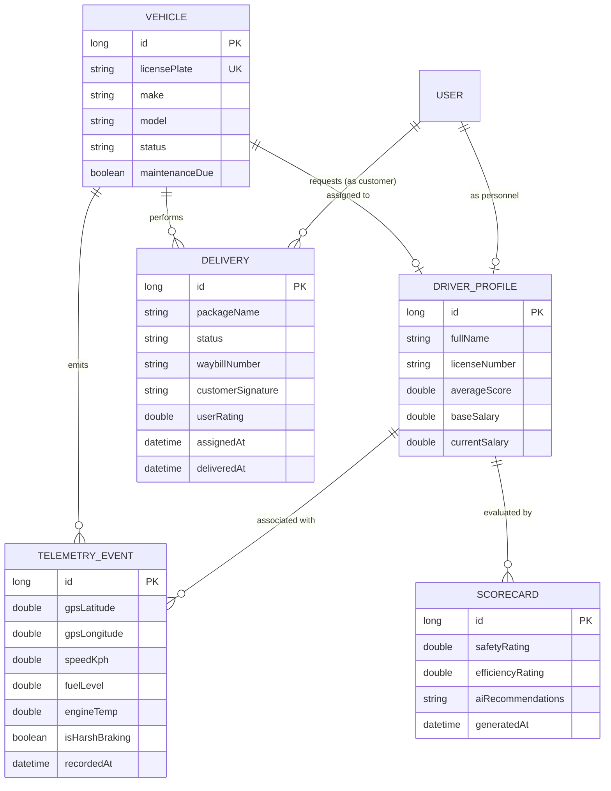
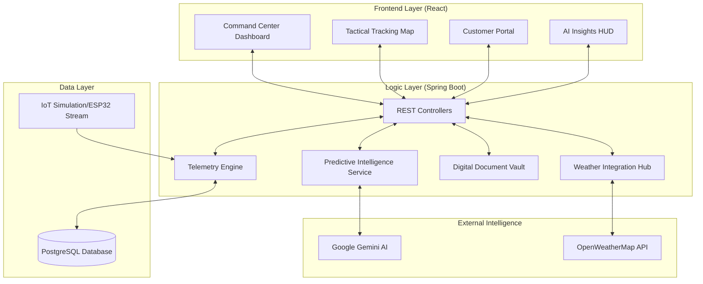
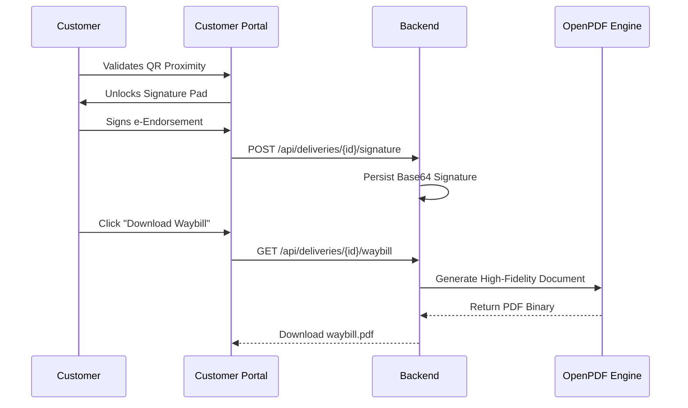

# OptiTrack System Documentation

This document contains high-fidelity Mermaid diagrams representing the OptiTrack logistics ecosystem's data architecture, system components, and operational workflows.

## 1. Entity Relationship (ER) Diagram
Represents the core data model and relationships between assets, personnel, and operational intelligence.

## 2. System Architecture Diagram
Illustrates the high-level infrastructure and data flow between the frontend, backend, and external intelligence engines.

## 3. Real-Time AI Telemetry Sequence
Demonstrates the data lifecycle: from IoT pulse to AI analysis and predictive visualization in the HUD.

```mermaid
sequenceDiagram
    participant IoT as IoT Unit (ESP32/Sim)
    participant BE as Spring Boot Backend
    participant Gemini as Google Gemini AI
    participant DB as PostgreSQL
    participant FE as React Dashboard (HUD)

    loop Every 4 Seconds
        IoT->>BE: POST /api/telemetry/record (Speed, Fuel, GPS)
        BE->>DB: Persist TelemetryEvent
        FE->>BE: GET /api/telemetry/latest/{id}
        BE-->>FE: Return Live Telemetry
    end

    rect rgb(20, 20, 40)
        Note over FE, Gemini: AI Predictive Insight Trigger
        FE->>BE: GET /api/predictive/insights/{id}
        BE->>DB: Fetch Latest 50 Events
        BE->>Gemini: POST /v1beta/models/gemini-1.5-flash:generateContent
        Gemini-->>BE: Return Strategic Route/Fuel Optimization
        BE-->>FE: Return Predictive JSON
        FE->>FE: Update AI Insights HUD
    end
```

## 4. Digital Signature & e-Waybill Flow
Illustrates the secure custody transfer and document generation workflow.

